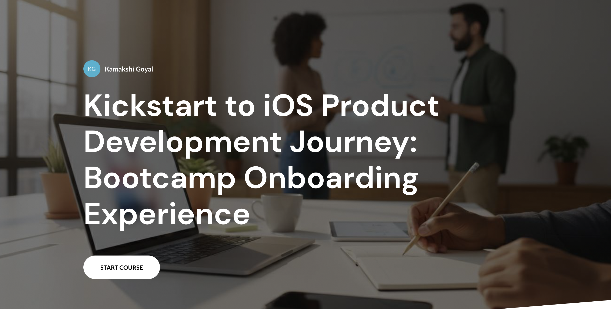
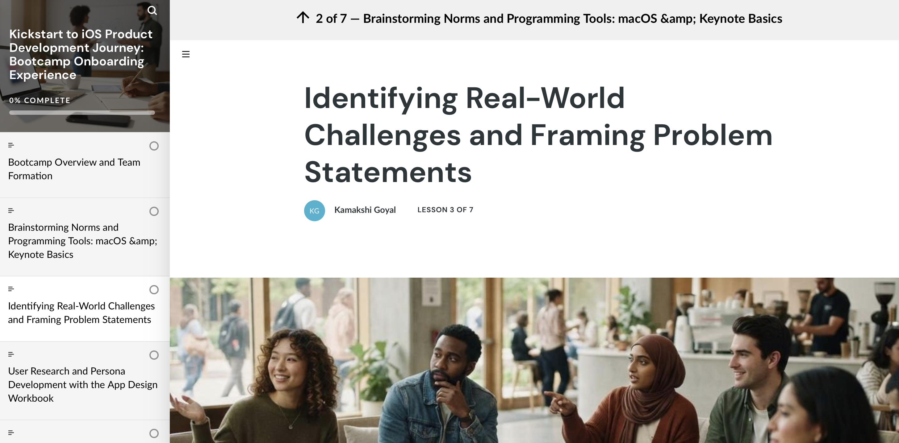
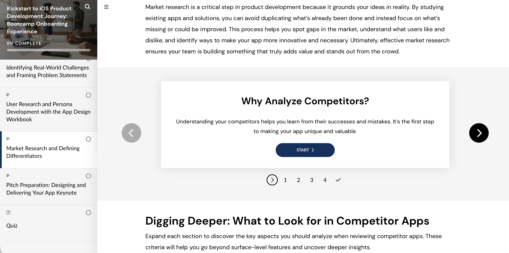
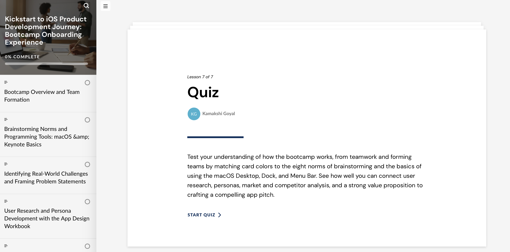

# iOS Product Development Bootcamp Onboarding Experience

An interactive seven-lesson onboarding course that prepares undergraduate students for an iOS Product Development Bootcamp through collaborative ideation, user research, competitor analysis, app differentiation, and pitch preparation.

## Live Course

[Launch the course](https://6a644c2213e47707e2227e4f--iridescent-narwhal-e461d6.netlify.app)

## Project Overview

This self-paced e-learning experience introduces students to the core skills and expectations needed for a fast-paced, three-day iOS product-development bootcamp. Learners follow the product journey from team formation and brainstorming through research, market analysis, and presenting an app concept.

## Target Audience

Undergraduate students selected for the iOS Development Centre Bootcamp.

## Learning Objectives

By the end of this course, learners will be able to:

- Describe the bootcamp structure, expectations, and team-formation process.
- Apply effective brainstorming norms in a collaborative setting.
- Use basic macOS and Keynote tools to support their project work.
- Identify real-world challenges and frame focused problem statements.
- Conduct user research and develop a user persona.
- Analyse competitors to identify market gaps and app differentiators.
- Prepare and deliver a clear, persuasive app pitch.

## Course Structure

1. Bootcamp Overview and Team Formation  
2. Brainstorming Norms and Programming Tools: macOS & Keynote Basics  
3. Identifying Real-World Challenges and Framing Problem Statements  
4. User Research and Persona Development with the App Design Workbook  
5. Market Research and Defining Differentiators  
6. Pitch Preparation: Designing and Delivering Your App Keynote  
7. Final Quiz  

## Instructional Design Approach

The course combines short instructional sections with interactive learning activities, including:

- Expandable content sections
- Flashcards
- Step-by-step process carousels
- Scenario-based knowledge checks
- Multiple-choice questions with immediate feedback
- Final quiz with an 80% passing score

## Tools Used

- Articulate Storyline 360
- Articulate Review 360
- Keynote
- macOS

## My Role

I designed and developed the course structure, learning objectives, instructional content, interactive learning activities, knowledge checks, assessment strategy, and visual learning experience.

## Skills Demonstrated

- Learning Experience Design
- Instructional Design
- Course Architecture
- Storyboarding
- Interactive E-Learning Development
- Assessment Design
- Scenario-Based Learning
- Visual Design
- SCORM Publishing

## Project Assets

## Project Assets

- [Course Design Document](./documentation/course-design-document.md)
- [Learning Objectives](./documentation/learning-objectives.md)
- [Course Outline](./documentation/course-outline.md)
- [Storyboard](./documentation/storyboard.md)
- [Graphic Design](./documentation/graphic-design.md)
- [Articulate Storyline Development](./documentation/storyline-development.md)
- [SCORM Publishing](./documentation/scorm-publishing.md)
- [Portfolio Case Study](./documentation/portfolio-case-study.md)
  
## Screenshots

## Course Screenshots

## SCORM Publishing

The course was published for LMS delivery as a SCORM package. It uses the final quiz/results slide for completion tracking and requires learners to achieve an 80% passing score.
